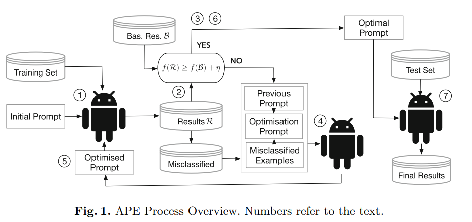
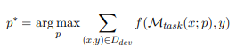

# Repositories:
- Python library to simplify prompt optimization https://github.com/hinthornw/promptimizer
- Python framework to define a composite structure for prompt enhancement https://github.com/stanfordnlp/dspy
- LiSSA Java framework to enhance during the thesis https://github.com/ArDoCo/LiSSA-RATLR
  - Goal: Write Classifiers in edu.kit.kastel.sqd.lissa.ratlr.classifier
  - Base class Classifier.java can be used as a parent to include different prompting techniques
  - Idea for manual prompting: Create enum with prompt strings that will be filled with content when the classifier is called
    - This is the way for https://www.promptingguide.ai/techniques
  - Automatic prompt optimization will require more implementation
  - Simple Classifier (Question) and Reasoning Classifier (Question + Provide your reasoning) are already implemented  
- Benchmark set to test TLR implementation https://github.com/ArDoCo/Benchmark/tree/ecsa22-msr4sa

# Gray Literature:
- neat overview of different simple prompting techniques with brief examples https://www.promptingguide.ai/techniques

# Initial Literature:
- Overview of Automatic Prompt Optimization (APO) techniques https://arxiv.org/pdf/2502.16923
  - provides a broad overview into the topic
  - splits prompt optimization into four steps with variable iteration depth
    - initialize seed prompts (generate prompt)
    - inference evaluation and feedback (improve prompt -> prompting techniques, evaluate generated prompt -> evaluation techniques)
    - candidate prompt generation
    - filter and retain promising prompts
  - they provide many sources for each different approach and variation
  - great for introduction and overview of existing work
- APO with gradient descent https://arxiv.org/pdf/2305.03495
  - performs a gradient descent to push corrections in the direction of the error
  - comparing the difference between expected results and given results using a prompt
  - beam search to iterate through improvements
    - beam search is a heuristic search algorithm that explores a graph by expanding the most promising node in a limited set https://en.wikipedia.org/wiki/Beam_search
    - expansion step: based on the (text based) differences new prompts are generated
    - selection step: which prompts should be carried to the next iteration step
      - testing on a subset of the training data to save time ->  UCBBandits algorithm https://enpc.hal.science/hal-00654404/
- Base framework to enhance with APO https://ardoco.de/c/icse25
  - artifacts (source code, documentation, requirements, models) are preprocessed and embedded for usage with naturale language LLMs
  - for each source element similar target elements are determined
  - mapping determines which target element is actually linked to the source element (TLR)
- Automatic Prompt Engineering (APE) for Requirement Engineering https://link.springer.com/chapter/10.1007/978-3-031-88531-0_15
  - 
  - Iterative approach until the result is better than baseline + margin or an upper limit is reached (omitted from the graphic)
  - Previous prompt is adjusted using a human designed optimization prompt
  - Uses a stateless LLM -> results are more consistent but quality may be lower

# Prompting Techniques:
- Few Shot Learning https://arxiv.org/abs/2005.14165
- Instruction Following https://arxiv.org/abs/2203.02155
- Zero Shot Reasoning https://arxiv.org/abs/2205.11916

# Evaluation Techniques:
- Benchmark Dataset for TLR between architecture models and documentation https://link.springer.com/chapter/10.1007/978-3-031-36889-9_30

# Else:
-  Fine-grained Traceability Link Recovery (FTLR) https://ieeexplore.ieee.org/abstract/document/9609109
- What is Prompt Engineering? https://arxiv.org/abs/2211.01910
- PE strategies for TLR https://ieeexplore.ieee.org/abstract/document/10260721
- PE as an optimization problem https://arxiv.org/abs/2311.05661
  - Small improvement over APO with gradient descent
  - Formulating a optimization problem to describe APO / APE
  - 
- Chain of Thought Prompting https://proceedings.neurips.cc/paper_files/paper/2022/file/9d5609613524ecf4f15af0f7b31abca4-Paper-Conference.pdf